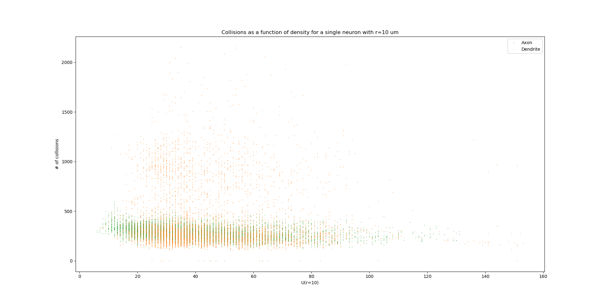

------------
Ongoing Work
------------

* I created the base for figure 2 in the article from code in
  ``collisions_vs_dist_naive.py``. It's a class which runs on existing
  graphs generated in ``analyze_graphs.py``, and finds and plots the
  density of the collisions as a function of the topological distance.
  This class now correctly calculates the "neural density" and normalizes
  the collision counts by them.

* Pablo wants me to check the "neural density". This metric checks how much
  "neuron" exists at at a certain distance from the soma. We expect that if
  a neuron's density is increased at some topological distance d, at that
  d the number of collisions will also increase.

* I also made many corrections to the manuscript that Yoav started.
  I labeled the versions before major changes.

* Discussion items for next meeting:
  1. How to show in the toy example that our pipeline detects orientation
  correctly? Should we show the neuron on pipes toy example? Discuss the
  statistics I used (Shapiro Wilk).
  2. How should the figure showing the distribution of collisions over time
  look like?
  3. Describe each figure we currently have.

* The ``for_article`` folder contains the needed figures and code for figure 1.
  I also wrote a few scripts to process the data that was generated by Yoav
  for these figures, which are located in the code folder. The shell scripts
  that ran the aggregation and NCD itself can also be found there.

* I created a folder named ``for article`` in the ``results`` folder, and made
  an ``svg`` with all of the figures for all of the neurons in a table, sorted
  by their cortical layer. Layer 2/3 neurons always show a spike in their
  axonal collisions vs distance plot, while the other neurons show a flat
  graph.

* I re-ran ``ctp2mesh.mat``, ``write_mesh_to_disk.m`` and ``csv_to_obj.py``
  to make sure that vascular object we've been working with is indeed the
  full object that can be created. It is indeed the case.

* The latest advancement in the collisions business is achieved in the class
  :class:`ncd_post_process.collisions_as_func_of_dist.CollisionsAndDistance`.
  This class takes an existing neuronal graph and adds information for each of
  the nodes about the closest collisions that are around it. However this is not
  done simply by comparing the distance between all collisions and all nodes.
  Instead, the algorithm finds the 5 closest points on the neuron to that
  collision and interpolates them so that there's a smoother surface
  between the neuron and the collision. Then it uses this new surface to
  calculate the distance.

* Following the April 3rd meeting we've come to realize that the original
  collision data that is generated in FCL is not using any interpolation, which means
  that the interpolation step described above is useless - it's overfitting
  the collision location. We will currently stay with the original implementation of
  the number of collisions as a function of distance which is located in
  ``collisions_vs_dist_naive.py``.

.. image:: work.jpg

* Following another meeting with Pablo on the 13 of May (image from the meeting),
  we decided to conduct the following analysis steps: Generate a "Neuron ID"
  document, which consists of several figures that are assigned to each neuron
  in our list:

  1. An image derived from Neurolucida's XML tree.
  #. An image of the mesh object as was received by FCL.
  #. A visualization of the neuron from Blender showing the collisions overlayed
     on the different neurites. The colors should resemble the original paper
     (blue is axon, orange is dendrite) and the actual way to represent the
     collisions might either be with a blob or by coloring the actual neuronal
     surface.
  #. A graph showing the number of collisions as a function of the topological
     distance.
  #. A graph showing the number of collisions as a function of :math:`U_n(r)`,
     which is the number of points on the neuron encompassed by a sphere with
     radius :math:`r` centered around a point on the neuronal tree. The graph
     should contain data from multiple :math:`r` values in different colors.
  #. A graph showing the number of collisions as a function of :math:`U_v(r)`,
     the total volume of the vasculature encompassed by a sphere with radius
     :math:`r` centered around a point on the neuronal tree.
  #. A scatter plot showing the values of :math:`U_n(r)` and :math:`U_v(r)` as
     a function of the topological distance of that point.
  #. 3D scatter plot for each point on the neuronal tree showing its assigned
     number of collisions, :math:`U_n(r)` and :math:`U_v(r)`.

  The code for these figures will be located in ``ncd_post_process/create_neuron_id``.

* The code in ``ncd_post_process/create_neuron_id/compare_collisions_with_density.py``
  creates a scatter plot of the number of collisions as a function of the
  density of a given neuronal point (shown below). We sometimes see two
  population of points on the dendritic tree - the lower and upper one. We see
  that the more complex a neural point is, the less likely it is to encounter
  a blood vessel.

* Due to the two populations which are visible in the scatter plot, we wish
  to display the points of that upper cloud on a neuron, probably using Blender.
  We'd also like to change the scale of the y-axis, so that it would show the
  "probability of collision", i.e. the fraction of collisions a point experienced
  out of the total iteration steps it has undergone. The scale of the y-axis will
  be [0, 1], with 1 being a 100% chance to collide with a blood vessel in every
  iteration (= neuron orientation).

* In May 26 I updated the y-axis of ``ncd_post_process/create_neuron_id/compare_collisions_with_density.py``
to be P(collision). This is calculated by dividing the number of collision by
100k, since we currently have 10k locations per cell, and we keep the data from
10 orientations.

* Meeting with Dan @ 26.5:

    1. Show the collisions on the neurons with Blender.
    #. Re-run NCD with lower collision thresholds, i.e. only permit locations
       and orientations that contain 20, 40, 50 collisions in total.
    #. Yoav will calculate :math:`U(r)` for all points on the vascular tree, for
       multiple :math:`r`s. Once he does that we want to match between each
       collision and its closest point on the vascular tree, essentially
       creating a mirror image of the collisions on top of the vasculature.
    #. The 3D scatter plot mentioned above is also important in understanding
       the relations between the points on the neuronal tree.
    #. Add to the scatter plots the distribution of the points on each axis.

* As a preparation for the upcoming 26.6 meeting, I've created a mini-ID PDF
figure for each neuron. The PDF contains a plot of the numbers of collision as
a function of :math:`U(r=10)`, with the distributions of :math:`U(r)` and the # collisions
on each side. It also contains a Blender render of the neuron with 3 axial
projections of the neuron overlayed with the number of collisions it felt
on each pixel. All plots were generated manually in Blender, with py3DN
and :class:`blender/overlay_collisions.py`.

* For the same meeting, I also added the method ``get_top_colls_percentile`` to
:class:`BranchDensityAndCollisions` as a way to save to disk only the locations
that had the highest chance to collide with blood vessels. I then followed by
using Blender to show the collisions on top of each neuron. It seems that
for the most part, these locations are on
 the dendritic tree of the neuron,
rather than on its axon.

* Yoav supplied the file ``calc_u_for_vascular.py`` which returns the :math:`U(r)`
value for each point on the vascular tree. The script takes
about 90 minutes to run for a single :math:`r` on Cortex. The next step is
to pair each collision with the appropriate :math:`U(r)` value, just like
I did for the neurons.

* In ``compare_collisions_with_density.py`` I added a function :func:`run_ur_topodist()`
which creates an instance of the class :class:`BranchDensityAndDist` which
ultimately plots the density :math:`U(r)` as a function of the topological
distance of a given point on the neural tree. The same trendline that appears
in the r=10 case is prominent in smaller R's as well.

* In ``compare_collisions_with_density.py`` I added a function
:func:`run_collisions_dens_jointplot_multiple_r()`
which plots the collisions as a function of density jointplot for a single
neuron with multiple R's (for :math:`U(r)`). The "double hump" trend is visible in
the different R's as well, suggesting that it's not an artifact of the r=10
measurement, but a true characteristic of the distribution.

* I installed blender at ``~/blender-2.79b-...`` to visualize large vascular
3D models.

